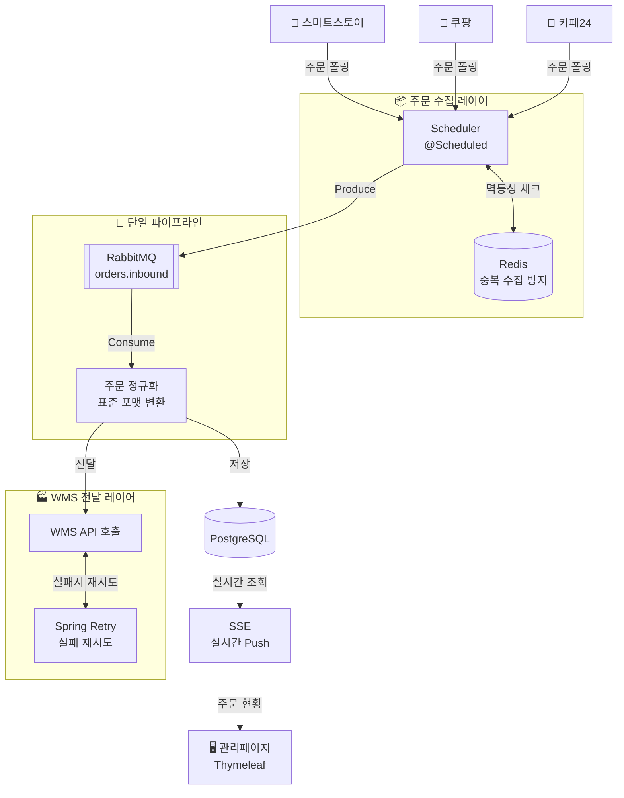

# order-bridge

> 여러 쇼핑몰 채널에서 들어오는 주문을 단일 파이프라인으로 수신하여 WMS까지 자동 전달하는 주문 관리 플랫폼

---

## 기술 스택


---

## 시스템 아키텍처



---

## 주요 기능

- **멀티 채널 주문 수집** - `@Scheduled` 기반 주기적 폴링
- **단일 파이프라인** - RabbitMQ를 통한 채널 통합 처리
- **주문 정규화** - 채널별 상이한 데이터 포맷을 표준 포맷으로 변환
- **WMS 자동 전달** - Spring Retry 기반 실패 재시도
- **중복 수집 방지** - Redis 기반 멱등성 처리
- **실시간 모니터링** - SSE 기반 관리페이지 실시간 주문 현황

---

## 프로젝트 구조

```
order-bridge/
├── src/main/java/com/orderbridge/
│   ├── collector/       # 채널별 주문 수집 (Scheduler)
│   ├── pipeline/        # RabbitMQ 발행/소비
│   ├── order/           # 주문 도메인
│   ├── wms/             # WMS 전달
│   └── common/          # 공통 설정
├── src/main/resources/
│   ├── application.yml
│   └── templates/       # Thymeleaf
├── .env.example
├── Dockerfile
└── docker-compose.yml
```

---

## 시작하기

### 사전 요구사항

- Docker Desktop 설치
- Java 21

### 환경변수 설정

```bash
# .env.example을 복사하여 .env 파일 생성
cp .env.example .env
```

`.env` 파일을 열어 값을 입력해요.

```bash
# Database
POSTGRES_DB=orderbridge
POSTGRES_USER=
POSTGRES_PASSWORD=

# RabbitMQ
RABBITMQ_USER=
RABBITMQ_PASSWORD=

# Spring Security
ADMIN_NAME=
ADMIN_PASSWORD=
```

### 실행

```bash
# 전체 실행 (Spring Boot + PostgreSQL + Redis + RabbitMQ)
docker compose up -d --build

# 로그 확인
docker compose logs -f app

# 중지
docker compose down

# 중지 + DB 초기화
docker compose down -v
```

### 접속

| 서비스 | URL |
|--------|-----|
| 관리페이지 | http://localhost:8080 |
| RabbitMQ 관리 UI | http://localhost:15672 |

---

## 개발 진행 현황

- [x] Mission 1 - 프로젝트 세팅 + Docker Compose
- [ ] Mission 2 - 주문 도메인 설계 + ERD
- [ ] Mission 3 - 주문 수집 (Scheduler + Collector)
- [ ] Mission 4 - RabbitMQ 파이프라인
- [ ] Mission 5 - WMS 전달 + Retry
- [ ] Mission 6 - 관리페이지 (Thymeleaf + SSE)