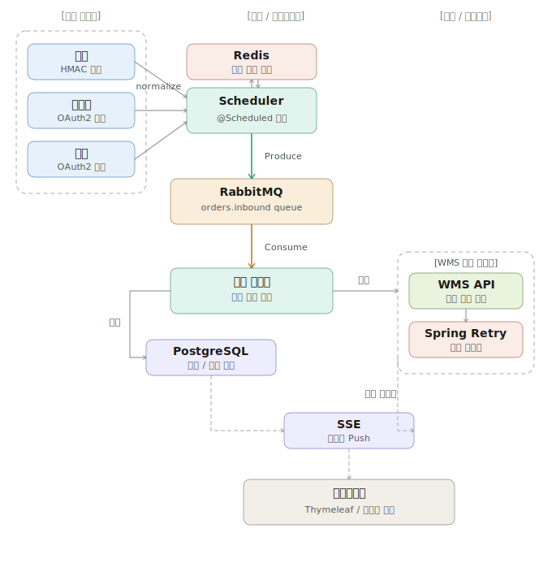

# order-bridge

> 여러 쇼핑몰 채널에서 들어오는 주문을 단일 파이프라인으로 수신하여 WMS까지 자동 전달하는 주문 관리 플랫폼

---

## 기술 스택


---

## 시스템 아키텍처



---

## 주요 기능

- **멀티 채널 주문 수집** - `@Scheduled` 기반 주기적 폴링
- **단일 파이프라인** - RabbitMQ를 통한 채널 통합 처리
- **주문 정규화** - 채널별 상이한 데이터 포맷을 표준 포맷으로 변환
- **WMS 자동 전달** - RetryTemplate 기반 실패 재시도 (Spring Framework 7.0 내장)
- **실시간 모니터링** - SSE 기반 관리페이지 실시간 주문 현황
- **클레임 처리** - 취소/반품/교환 CTI 다형성 구조
- **Redis 캐싱** - 주문 조회 캐싱 (`@Cacheable`) + 주문 중복 수집 방지 (Set) + 메시지 멱등성 보장 (SETNX)

---

## 도메인 설계

### ERD

| 테이블 | 설명 |
|---|---|
| `channels` | 채널 마스터 (스마트스토어, 쿠팡, 카페24 등) |
| `orders` | 수집된 주문 원본 |
| `order_items` | 주문 상품 — 수량만큼 row 분할 (1개 = 1 row) |
| `order_status_histories` | 주문 상태 변경 이력 |
| `wms_deliveries` | WMS 전달 및 재시도 이력 |
| `claims` | 클레임 공통 부모 (CTI 전략) |
| `cancels` | 취소 전용 데이터 |
| `returns` | 반품 전용 데이터 |
| `exchanges` | 교환 전용 데이터 |

### 주문 상품 분할 전략

주문 1건에 상품 N개 → `order_items`에 N개 row (수량 고정 1)
부분 취소 / 부분 클레임 / 셀러별 처리를 row 단위로 독립 관리

### 클레임 다형성 구조 (CTI)

JPA `@Inheritance(strategy = InheritanceType.JOINED)` 전략 적용.
공통 속성은 `claims`, 타입별 고유 속성은 각 자식 테이블에 분리.

```
Claim (abstract)
├── Cancel  — 환불금액, 환불수단
├── Return  — 수거지, 택배사, 운송장번호, 환불금액
└── Exchange — 교환상품코드, 재발송지, 택배사, 운송장번호
```

### DB 마이그레이션 (Flyway)

| 버전 | 내용 |
|---|---|
| V1 | channels 생성 |
| V2 | orders 생성 |
| V3 | order_items 생성 |
| V4 | order_status_histories 생성 |
| V5 | wms_deliveries 생성 |
| V6 | claims / cancels / returns / exchanges 생성 |
| V7 | Spring Security 사용자 설정 |

---

## 프로젝트 구조

```
order-bridge/
├── src/main/java/hello/orderbridge/
│   ├── channel/         # 채널 도메인
│   ├── order/           # 주문 도메인
│   ├── claim/           # 클레임 도메인 (취소/반품/교환)
│   ├── collector/       # 채널별 주문 수집 (Scheduler)
│   ├── pipeline/        # RabbitMQ 발행/소비
│   ├── wms/             # WMS 전달
│   ├── config/          # 설정 (RabbitMQ, Redis, Security)
│   └── common/          # 공통 (BaseEntity, LoginController)
├── src/main/resources/
│   ├── db/migration/    # Flyway SQL
│   ├── application.yml
│   ├── templates/       # Thymeleaf (login, order/list, order/detail)
│   └── static/          # CSS, JS (SSE)
├── .env.example
├── Dockerfile
└── docker-compose.yml
```

---

## 시작하기

### 사전 요구사항

- Docker Desktop 설치
- Java 21

### 환경변수 설정

```bash
cp .env.example .env
```

`.env` 파일을 열어 값을 입력합니다.

```bash
# Database
POSTGRES_DB=orderbridge
POSTGRES_USER=
POSTGRES_PASSWORD=

# RabbitMQ
RABBITMQ_USER=
RABBITMQ_PASSWORD=

# Spring Security
ADMIN_NAME=
ADMIN_PASSWORD=
```

### 실행

```bash
# 전체 실행 (Spring Boot + PostgreSQL + Redis + RabbitMQ)
docker compose up -d --build

# 로그 확인
docker compose logs -f app

# 중지
docker compose down

# 중지 + DB 초기화
docker compose down -v
```

### 접속

| 서비스 | URL |
|---|---|
| 관리페이지 | http://localhost:8080 |
| RabbitMQ 관리 UI | http://localhost:15672 |

---

## 개발 진행 현황

- [x] Mission 1 - 프로젝트 세팅 + Docker Compose
- [x] Mission 2 - 주문 도메인 설계 + ERD + Entity + Flyway
- [x] Mission 3 - 주문 수집 (Scheduler + Collector)
- [x] Mission 4 - RabbitMQ 파이프라인
- [x] Mission 5 - WMS 전달 + Retry
- [x] Mission 6 - 관리페이지 (Thymeleaf + SSE)
- [x] Mission 7 - 클레임 처리 (취소/반품/교환)
- [x] Mission 8 - Redis 활용 (캐싱/중복 방지)
- [ ] Mission 9 - 예외 처리 + AOP 에러 로깅 (@ControllerAdvice, 커스텀 예외, @Around)
- [ ] Mission 10 - 페이징 + 검색 (Pageable, 채널/상태/날짜 필터링)
- [ ] Mission 11 - REST API 분리 (/api/v1, Swagger)
- [ ] Mission 12 - Actuator + Prometheus + Grafana (모니터링 대시보드)
- [ ] Mission 13 - DLQ + 실패 관리 (RabbitMQ Dead Letter Queue)
- [ ] Mission 14 - 테스트 강화 (Testcontainers 통합 테스트)
